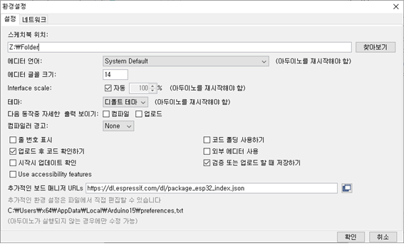
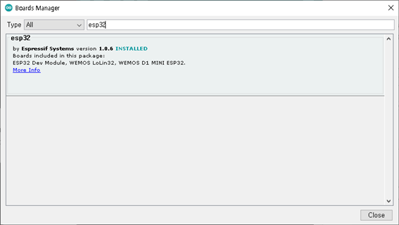
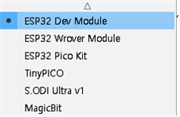
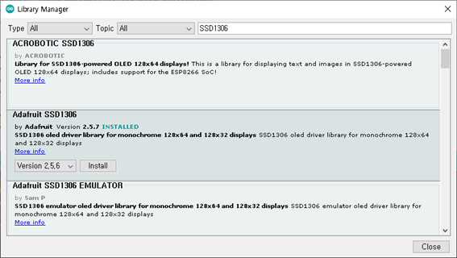
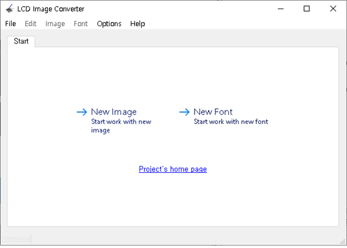
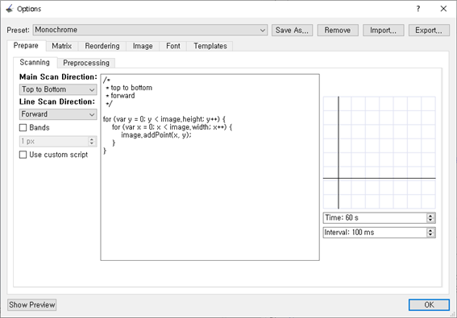
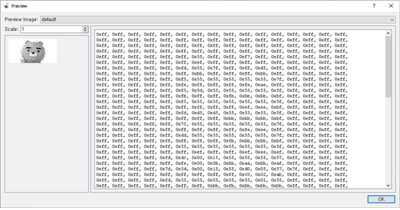

## ESP32   

> 설치   

메뉴에서 File → Preference를 실행하고 Additional Boards Manager URLs 항목에 다음을 추가한다.   
https://raw.githubusercontent.com/espressif/arduino-esp32/gh-pages/package_esp32_index.json   



메뉴에서 Tools → Board → Board Manager 를 실행하고 esp32 를 설치한다.   

    

메뉴에서 Tools → Board → ESP32 Arduino → ESP32 Dev Module 을 선택한다.   

   

메뉴에서 Tools → Port 에서 ESP32 보드의 포트를 선택한다. 그리고 다음 예제를 업로드한다.   

```   
int LED_BUILTIN = 2;

void setup()
{
	pinMode(LED_BUILTIN, OUTPUT);
}

void loop()
{
	digitalWrite(LED_BUILTIN, HIGH);
	delay(1000);
	digitalWrite(LED_BUILTIN, LOW);
	delay(1000);
}
```   

> 핀맵   

[pinmap](https://i0.wp.com/randomnerdtutorials.com/wp-content/uploads/2018/08/ESP32-DOIT-DEVKIT-V1-Board-Pinout-36-GPIOs-updated.jpg?w=750&quality=100&strip=all&ssl=1) (Link)  

> Input only pins   

GPIO 34   
GPIO 35   
GPIO 36   
GPIO 39   

> SPI 내부 플래시 메모리   

GPIO 6 ~ GPIO 11 까지 핀은 내부 SPI 플래시 메모리에 연결되어 있다. 이 핀들은 사용하지 않도록 한다.   

GPIO 6 (SCK/CLK)   
GPIO 7 (SDO/SD0)   
GPIO 8 (SDI/SD1)   
GPIO 9 (SHD/SD2)   
GPIO 10 (SWP/SD3)   
GPIO 11 (CSC/CMD)   

> 시리얼 통신   

[source](../src/02_SERIAL/SERIAL.ino)   

> ADC   

ADC2 핀은 Wi-Fi가 사용될 때 사용될 수 없다.    

ADC1_CH0 (GPIO 36)   
ADC1_CH1 (GPIO 37)   
ADC1_CH2 (GPIO 38)   
ADC1_CH3 (GPIO 39)   
ADC1_CH4 (GPIO 32)   
ADC1_CH5 (GPIO 33)   
ADC1_CH6 (GPIO 34)   
ADC1_CH7 (GPIO 35)   
ADC2_CH0 (GPIO 4)   
ADC2_CH1 (GPIO 0)   
ADC2_CH2 (GPIO 2)   
ADC2_CH3 (GPIO 15)   
ADC2_CH4 (GPIO 13)   
ADC2_CH5 (GPIO 12)   
ADC2_CH6 (GPIO 14)   
ADC2_CH7 (GPIO 27)   
ADC2_CH8 (GPIO 25)   
ADC2_CH9 (GPIO 26)   

[source](../src/03_ANALOG/ANALOG.ino)   

> PWM   

ESP32 LED PWM 컨트롤러는 16개의 독립적인 채널이 있다. 이 16개의 채널은 PWM 신호를 생성하기 위해 다른 속성으로 설정할 수 있다. GPIO 34 ~ 39를 제외하고 모든 핀은 PWM 핀으로 사용될 수 있다.   

[source](../src/04_PWM/PWM.ino)   

> I2C   

ESP32는 두 개의 I2C 채널이 있고 어떤 핀이든 SDA 혹은 SCL 으로 설정할 수 있다. 디폴트 I2C 핀은 다음과 같다.   

GPIO 21 (SDA)   
GPIO 22 (SCL)   


[source](../src/05_I2C/SCAN/SCAN.ino)   

> VSPI   

GPIO 23   
GPIO 19   
GPIO 18   
GPIO 5   

[source](../src/06_SPI/SPI.ino)   

> INTERRUPT   

모든 GPIO는 인터럽트로 설정될 수 있다. 아두이노에서는 다음 함수로 인터럽트를 설정한다.   

```
attachInterrupt(digitalPinToInterrupt(GPIO), function, mode);
- digitalPinToInterrupt(GPIO) : 해당 GPIO 핀을 인터럽트 핀으로 설정한다.
- function : 인러럽트 처리 함수
- mode : LOW, HIGH, CHANGE, FALLING, RISING
```
[source](../src/07_INTERRUPT/INTERRUPT.ino)   

> OLED SSD1306 Library 설치   

Arduino 의 메뉴에서 Sketch → Include Library → Manager Libraries 를 실행한 후 SS1306을 입력하고 Adafruit SS1306 by Adafruit 를 설치한다.   

   

> OLED 테스트하기  

Arduino 를 실행한 후 메뉴에서 File → Examples → Adafruit SSD1306 ssd1306_128x64_i2c 예제를 업로드 해본다. 이 때 SCREEN_ADDRESS 는 0x3C 로 설정하도록 한다.   

```
#define SCREEN_ADDRESS 0x3C
```

> OLED 텍스트 출력하기   

[source](../src/09_OLEDTEXT/OLEDTEXT.ino)   

> 폰트 변경하기   

- 다음 폰트 중 하나를 선택할 수 있다.   

FreeMono12pt7b.h   
FreeSansBoldOblique12pt7b.h   
FreeMono18pt7b.h   
FreeSansBoldOblique18pt7b.h   
FreeMono24pt7b.h   
FreeSansBoldOblique24pt7b.h   
FreeMono9pt7b.h   
FreeSansBoldOblique9pt7b.h   
FreeMonoBold12pt7b.h   
FreeSansOblique12pt7b.h   
FreeMonoBold18pt7b.h   
FreeSansOblique18pt7b.h   
FreeMonoBold24pt7b.h   
FreeSansOblique24pt7b.h   
FreeMonoBold9pt7b.h   
FreeSansOblique9pt7b.h   
FreeMonoBoldOblique12pt7b.h   
FreeSerif12pt7b.h   
FreeMonoBoldOblique18pt7b.h   
FreeSerif18pt7b.h   
FreeMonoBoldOblique24pt7b.h   
FreeSerif24pt7b.h   
FreeMonoBoldOblique9pt7b.h   
FreeSerif9pt7b.h   
FreeMonoOblique12pt7b.h   
FreeSerifBold12pt7b.h   
FreeMonoOblique18pt7b.h   
FreeSerifBold18pt7b.h   
FreeMonoOblique24pt7b.h   
FreeSerifBold24pt7b.h   
FreeMonoOblique9pt7b.h   
FreeSerifBold9pt7b.h   
FreeSans12pt7b.h   
FreeSerifBoldItalic12pt7b.h   
FreeSans18pt7b.h   
FreeSerifBoldItalic18pt7b.h   
FreeSans24pt7b.h   
FreeSerifBoldItalic24pt7b.h   
FreeSans9pt7b.h   
FreeSerifBoldItalic9pt7b.h   
FreeSansBold12pt7b.h   
FreeSerifItalic12pt7b.h   
FreeSansBold18pt7b.h   
FreeSerifItalic18pt7b.h   
FreeSansBold24pt7b.h   
FreeSerifItalic24pt7b.h   
FreeSansBold9pt7b.h   
FreeSerifItalic9pt7b.h   

- 폰트를 사용하기 위해 폰트 헤더 파일을 include 한다.   

(예)   
#include <Fonts/FreeSerif12pt7b.h>   

- setFont 메서드로 폰트를 설정한다.   

(예)   
display.setFont(&FreeSerif12pt7b);   

- 원래 폰트로 변경하려면 매개변수 없이 setFont() 메서드를 호출하면 된다.   
display.setFont();   

(예)   
[source](../src/10_OLEDFONT/OLEDFONT.ino)   

> Shape 메소드   

- drawPixel(x, y, color)   
- drawLine(x1, y1, x2, y2, color)   
- drawRect(x, y, width, height, color)   
- drawRoundRect(x, y, width, height, radius, color)   
- fillRoundRect(x, y, width, height, radius, color)   
- drawCircle(x, y, radius, color)   
- drawTriangle(x1, y1, x2, y2, x3, y3, color)   
- invertDisplay(true or false)   

(예)
[source](../src/11_OLEDSHAPE/OLEDSHAPE.ino)   

> 이미지 표시하기   

- 그림판에서 124 × 64 이미지 파일을 열고 메뉴에서 파일 → 다른 이름으로 저장 명령을 실행하고 파일 형식을 “단색 비트맵(*.bmp; *.dib)" 으로 설정하여 저장한다.   

- https://sourceforge.net/projects/lcd-image-converter/files/ 사이트에서 lcd image converter 프로그램을 다운로드하고 실행한다.   

   

- 메뉴에서 File → Open 명령을 실행하고 이미지 파일을 열고 메뉴에서 Options → Conversion 명령을 실행하고 Preset은 Monochrome, Main Scan Direction 은 Top to Bottom, Line Scan Direction은 Forward 으로 설정한 후 OK 버튼을 누른다.   

   

   

- 메뉴에서 File → Convert 명령을 실행하고 C 파일을 생성한다. 그런 후 생성된 배열을 ino 파일에 넣고 drawBitmap() 메서드로 화면에 출력하면 된다.   

(예)   
[source](../src/12_OLEDIMAGE/OLEDIMAGE.ino)   

> ESP32 WiFi Server   

(예)   
[source](../src/13_SERVER/SERVER.ino)   


